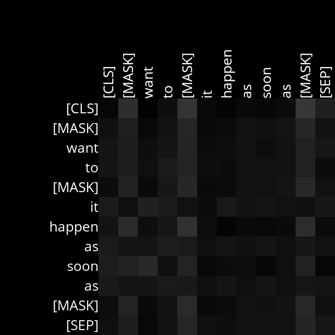
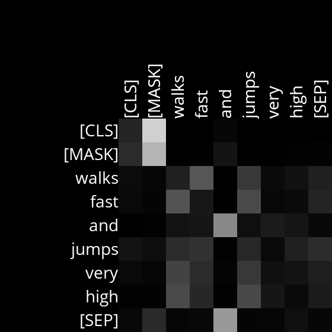

# Analysis

## Layer 1, Head 1 
In this head, every word is paying attention to [MASK] tokens (attention is lesser than moderate).

Example Sentences:
- find my [MASK] right on the [MASK]
- [MASK] want to [MASK] it happen as soon as [MASK]

## Layer 1, Head 2  
In this head, [CLS] & [MASK] are paying attention to [MASK] (attention level is very high), moreover 
verbs and adverbs are bidirectionally paying attention to each other(attention level is okay)

Example Sentences:
- [MASK] walks fast and jumps very high
- she talks very quitely in [MASK]  

> GODDDDD CS50AI is so much fun, i would love if they made more lectures!!!

